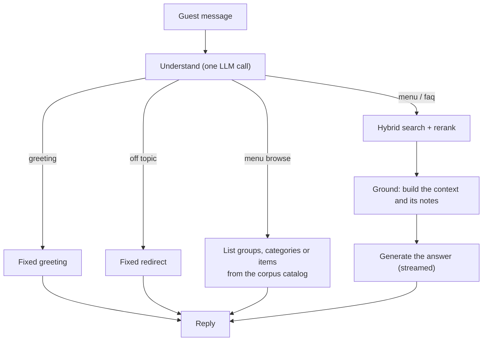

# wagami-rag-en

An agentic **Retrieval-Augmented Generation** chatbot for a restaurant menu.
Guests ask about dishes, prices, per-serving nutrition and allergens, and get
answers grounded entirely in a curated knowledge base rather than a language
model's own knowledge. English-only. The repo holds the FastAPI service, the
LangGraph agent, the guest-facing chat page, and the tooling that loads the
knowledge base into Weaviate Cloud.


**Staging:** <https://wagami-rag-en-staging.onrender.com> — deployed from `develop`
(it runs on Render's free plan, so the first request after a quiet spell can be slow
while the service wakes up).

## What it does

A guest asks something like *"which vegan ramen has the fewest calories?"* or
*"does the katsu curry contain gluten?"*. The agent turns the question into a
hybrid (vector + keyword) search over a Weaviate Cloud collection, reranks the
hits, and an LLM composes the answer from **only those rows**. Every dish the answer
contains is shown as a card with its photo, and only those dishes — never a card left
over from an earlier answer. When the knowledge base doesn't
hold the answer, the agent says so rather than inventing one.

Not every message needs a search. One LLM call reads the message and decides how
it is handled:

| The guest says | Handled as | LLM calls |
|---|---|---|
| "hello" | fixed greeting | 1 |
| something unrelated to the restaurant | fixed, polite redirect | 1 |
| "what's on the menu?", "show me the drinks", "sides" | the menu's groups → categories → items, straight from the corpus: groups and categories as picture cards (the name and a dedicated picture for it), items each described with a card and its own dish photo — no search | 1 |
| a dish, ingredient, price, allergy, or a filtered question ("vegan starters under £6") | hybrid search → rerank → grounded answer | 2 |
| hours, bookings, delivery, payments | the same search path over the FAQ rows | 2 |

A "browse" that states a diet, allergy, price, calorie or protein requirement is
always turned into a real search in code, so allergen exclusion is never skipped.

## How a message flows



## Architecture

| Layer | Component |
|---|---|
| API & UI | FastAPI service: `POST /chat`, streaming `POST /chat/stream` (SSE), session endpoints, `/healthz`, and a server-rendered chat page at `/` (plain JS + CSS, no build step) |
| Agent | LangGraph state graph: *query → respond \| retrieve → ground → answer* |
| Retrieval | Weaviate Cloud hybrid search over one `KnowledgeBase` collection, then Cohere rerank |
| Embeddings | Cohere `embed-english-v3.0` via Weaviate's `text2vec-cohere` module — only the composed `embedding_text` field is vectorized; everything else is structured metadata for filtering and display |
| LLM | Groq (OpenAI-compatible API); the query-understanding and answer-generation models are set separately |
| Memory | Redis Stack: per-session conversation history (LangGraph checkpointer), rate-limit counters, and token-budget counters |
| Prompts | Every system prompt lives in [`app/agent/prompts.py`](app/agent/prompts.py); the app and the notebooks import the same objects |

## Safety, limits and cost control

- **Grounded only.** The generation prompt answers from the retrieved rows and
  declines otherwise; a scope and prompt-injection guard is part of every call,
  and an output-side check blocks replies that leak the instructions.
- **Rate limit:** 10 chat requests a minute per client IP (Redis-backed).
- **Input cap:** messages over 500 characters are rejected before any LLM call.
- **Token budgets:** a daily and a monthly cap, and a maximum number of turns per
  conversation; when one is reached the guest gets a polite "at capacity" reply.
- **Kill switch:** `CHAT_ENABLED=false` takes `/chat` offline (503) on the next restart.
- **Privacy:** access logs are structured and never include the guest's message.
- **Hardening:** security headers on every response (CSP, `X-Frame-Options`,
  `nosniff`, no-referrer, HSTS in production); `/docs` and `/redoc` are off in production.

## API

| Endpoint | Purpose |
|---|---|
| `GET /` | the guest chat page |
| `POST /session` | start a conversation → `{"session_id": ...}` |
| `POST /chat` | `{"session_id", "message", "browse"?}` → `{"session_id", "answer", "cited_items", "choices"}` |
| `POST /chat/stream` | same request; server-sent events `delta` (text as it is written), `done` (final answer + cited items), `error` |
| `DELETE /session/{session_id}` | end a conversation and drop its history |
| `GET /healthz` | liveness probe |

Each entry of `cited_items` has `id`, `slug`, `name`, `description`, `ingredients`,
`price_gbp` and `image`. `choices` is `null` except for a reply that lists menu groups or
categories, where it holds `intro`, `outro` and `cards` (`name`, `image`, `group`, `category`) so
the page can show a picture card per name between the two sentences instead of a bullet list
(`answer` still has the whole text, list included). `cited_items` belongs to that answer alone:
the dishes it names (or a listing shows), and empty when it names none.

Every card on the chat page can be clicked instead of typing (the magnifier on its picture zooms
it instead), and the reply simply appears -- the question the click sends is not shown as a
guest message, though it is saved to the conversation history. A group's card lists its
categories and a category's card lists its items: the page sends a readable `message` plus `"browse": {"group", "category"}` (from the card, `category` is
`null` for a group), and the server answers that browse from the menu catalog with no model call.
A dish's card sends "Tell me about <name>" as an ordinary message.

## Menu images

`IMAGE_BASE_URL` points at a `menu/` folder (`data/images/menu/` locally, served at
`/images/menu`) laid out like the menu itself, with folder names lower-cased and anything that
isn't a letter or digit collapsed to one hyphen (`app/agent/choice_images.py`):

- a dish photo at `<group>/<category>/<image>`, where `<image>` is the row's own `image` filename
  and the folders come from its `category_path` — or straight in `<group>/` when the group's only
  category has the group's own name (`extras`, `lunch time`, `desserts + sweet treats`);
- a `cover.png` in every group folder, shown on that group's card in the menu overview
  (`group_image_filename()`), and in every category folder, shown on that category's card in its
  group's list (`category_image_filename()`). A category's folder sits inside its group's, so
  `drinks` (a group) and `kids/drinks` (a category), or `kids/ramen` and `the-main-event/ramen`,
  each have their own cover.

A picture that is missing is not an error: the card just shows its name.
Run `uv run python scripts/list_choice_images.py` for every path the currently loaded
`data/knowledge_base.json` needs, and which of them are missing from `data/images/menu/` — a
hand-written list drifts out of sync the moment the corpus changes. It also flags a category that, with today's menu shape, a guest can never actually
browse to (a group with only that one category goes straight to its items, no category card;
see the script's own output for which ones and why) — those are safe to skip.

## Knowledge base

`data/knowledge_base.json` is a flat array of 197 rows: 162 `menu_item` rows (one
per dish) and 35 `faq` rows, told apart by `item_type`. All 30 keys are present on
every row (`null` where a field doesn't apply — FAQ rows null out the menu-specific
fields):

| Group | Fields |
|---|---|
| Identity | `id`, `item_type`, `name`, `slug`, `description`, `ingredients`, `category` / `category_slug` / `category_path` |
| Retrieval | `embedding_text` — the only vectorized field |
| Price | `price_gbp` |
| Nutrition (per serving) | `kcal`, `protein_g`, `fat_g`, `carbs_g`, `sugars_g`, `sat_fat_g`, `sodium_g`, `salt_g`, `fibre_g` |
| Allergens & diet | `allergens_contains`, `allergens_may_contain`, `dietary_tags`, `is_gluten_free_listed` |
| Serving | `portion_value` / `portion_unit`, `servings`, `abv_percent` |
| Media & meta | `image`, `last_updated` |

The menu is organised as **group → category → items** (for example *drinks →
cocktails → the dishes*), taken from `category_path` and `category`. At startup the
service profiles the corpus into an in-memory catalog that drives menu browsing
and is also rendered into the query-understanding prompt.

The corpus and the dish photos are a demo dataset and are **not included in this
repository** — provide your own `data/knowledge_base.json` in the same shape, and
host the images wherever `IMAGE_BASE_URL` points. The cards for menu groups and categories show the
`cover.png` in that group's or category's own image folder — see **Menu images** below for the
layout.

## Getting started

Requires **Python 3.14** and [uv](https://docs.astral.sh/uv/). The supported
setup is the VS Code dev container (Docker Compose: the app, Redis Stack, debugpy).

```bash
cp .env.example .env     # then fill in the values below
```

Open the folder in the dev container. **The server starts by itself with the
container** on <http://localhost:8000> and **reloads on its own** whenever you save
a `.py`, `.css` or `.js` file under `app/` — there is nothing to start or restart.

```bash
tail -f /tmp/dev-server.log            # server logs (inside the container)
pkill -f scripts/dev_server.py         # restart it by hand; it comes back in ~10 s
```

If a start fails (Weaviate unreachable, a syntax error), the container stays up and
the server tries again the next time a file under `app/` is saved.

Without the dev container, run `uv sync`, start Redis Stack on `:6379`, and use
`uv run python scripts/dev_server.py`.

### Configuration

All configuration is via environment variables / `.env`:

| Variable | Purpose |
|---|---|
| `APP_ENV`, `PORT`, `LOG_LEVEL` | `development` or `production` (production turns off `/docs` and adds HSTS), listen port, log level |
| `CHAT_ENABLED` | set `false` to take `/chat` offline |
| `WEAVIATE_URL` | Weaviate Cloud cluster |
| `WEAVIATE_API_KEY` | admin key — used only by the scripts that create, empty and load the collection |
| `WEAVIATE_READ_API_KEY` | read-only key — used by the running service |
| `EMBEDDING_PROVIDER`, `EMBEDDING_API_KEY` | `cohere` (`embed-english-v3.0`) or `openai`; with Cohere the same key also drives rerank |
| `GROQ_API_KEY` | LLM access |
| `UNDERSTAND_MODEL`, `GENERATION_MODEL` | models for query understanding and answer generation |
| `REDIS_URL` | Redis **Stack** (not plain Redis): session memory, rate limits, token budgets |
| `IMAGE_BASE_URL` | public base URL of the `menu/` image folder (see **Menu images**) |
| `DAILY_TOKEN_LIMIT`, `MONTHLY_TOKEN_LIMIT`, `MAX_CONVERSATION_TURNS` | cost-control limits |

### Loading the knowledge base

```bash
uv run python scripts/load_knowledge_base.py                    # create the collection + import
uv run python scripts/delete_knowledge_base.py --keep-schema     # empty it, keep the schema
uv run python scripts/delete_knowledge_base.py                   # drop the collection entirely
```

Both scripts write to live Weaviate Cloud. The schema lives in
`load_knowledge_base.py` and is imported by the delete script so the two can't drift.

## Development

```bash
uv run ruff check .                        # lint
uv run ruff format .                       # format
uv run mypy scripts app                    # type-check
uv run pytest --cov=app --cov-report=term  # tests — fake LLM and Weaviate, no live calls
```

- `scripts/latency_check.py` sends a few questions to a running server and reports
  time to first word and total time per turn, optionally with the server's own
  per-stage breakdown.
- `scripts/adversarial_check.py` sends jailbreak, prompt-injection and off-topic
  probes to a running app and flags any reply that complies or leaks the prompt.
- `notebooks/` — `01` retrieval checks, `02` generation checks, `03` an evaluation
  harness (gold questions, deterministic safety checks, an LLM judge, latency
  percentiles). `02` and `03` import the app's own pipeline code (prompts,
  understanding, retrieval, prompt assembly, cards), so they exercise what actually ships. Re-run `03` after any prompt change.

Pre-commit hooks, GitHub Actions CI (lint · type-check · test · dependency audit ·
Dockerfile scan), and Dependabot are configured. See
[.github/CONTRIBUTING.md](.github/CONTRIBUTING.md) for the branching model,
branch-protection rulesets, and release flow.

## Deployment

```
feature/*  ─PR─▶  develop  ─PR─▶  main
                     │              │
                  staging       production
```

Merging to `develop` or `main` (both PR-only) runs CI; when it is green,
[`docker.yml`](.github/workflows/docker.yml) builds the production image
([`docker/Dockerfile.prod`](docker/Dockerfile.prod): multi-stage `uv` build,
non-root, gunicorn with uvicorn workers), scans it, pushes it to GHCR
(`staging` from `develop`, `latest` from `main`) and calls the matching Render
deploy hook. [`render.yaml`](render.yaml) is the Blueprint for the two Render
services. Staging is live at <https://wagami-rag-en-staging.onrender.com>.

## Project layout

```
app/
  main.py            FastAPI app: routes, middleware, chat turns
  config.py          settings (env / .env)
  cost_control.py    token budgets and conversation limits
  retrieval.py       Weaviate hybrid search + Cohere rerank
  agent/
    graph.py         the LangGraph state graph
    understanding.py query understanding: routing, filters, safety nets
    catalog.py       corpus profile: groups, categories, items
    browse.py        replies that need no search
    generation.py    grounded answer prompt and output checks
    prompts.py       every system prompt
    llm.py, memory.py, checkpointer.py
  templates/, static/  the chat page
scripts/             knowledge-base load/delete, dev server, latency and adversarial checks
notebooks/           retrieval, generation and evaluation notebooks
tests/               pytest suite
docker/              dev and production images
```

## License

**Code** — [MIT](LICENSE) © 2026 Ali Haidar. Covers everything in this
repository: the scripts, schema, configuration, and tooling.

**Data** — the `data/` corpus is a separate demo dataset. It is not included
in this repository and is **not** licensed here; supply your own
`data/knowledge_base.json`.
